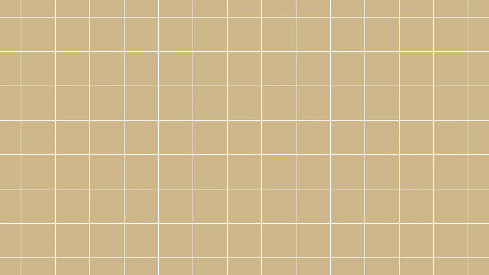

## A selection of animations created using manim

These are samples of animations that appear in videos on my [Youtube channel](https://www.youtube.com/channel/UCMOoG4xb3o0XfG0DcQUkO4Q). Information on the Python package can be found on the [manim repository](https://github.com/ManimCommunity/manim).

### Triple Clebsch Graph 

##### (from [Colouring Graphs and Fermat's Conjecture](https://www.youtube.com/watch?v=w2T12mnk7tg))

This creates a Clebsch graph with blue edges. Two permutations of the graph are then shown in succession using copies of the original (first in red edges, second in yellow edges). This is orchestrated in such a way that the resulting graph is complete and 3-coloured without monochromatic triangles. This is how the Ramsey number R(3,3,3) is established (after the standard counting argument to prove the bound R(3,3,3) ≤ 17).

[Source code](triple-clebsch-graph/triple-clebsch-graph.py)

---------

### Shattered Line

##### (from [Chaotic Orderings of the Rationals and Reals](https://www.youtube.com/watch?v=ppaXUxsEjMQ))

This creates a line (or rather, a series of densely packed points which give the illusion of one; density can be increased easily if the illusion is not convincing enough). The line is then broken and pieces scattered along semi-circular paths, reforming into a 'permuted' line.

[Source code](shatter-line/shatter-line.py)

---------

### Flying Angel

##### (from [Strategy on an Infinite Chessboard between an Angel and a Devil](https://www.youtube.com/watch?v=JvhSRCfCHb4))

This creates an angel-like figure, flying into the frame, flapping its wings, and flying away.

[Source code for building the angel figure](flying-angel/angel.py)

[Source code for animation](flying-angel/angel-flying.py)
